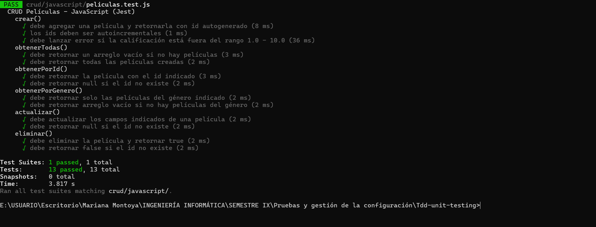
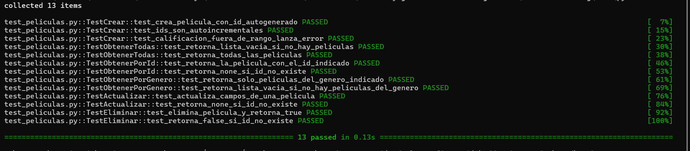

# CRUD Grupal — TDD con dos lenguajes

## Descripción

Implementación de un CRUD de películas aplicando la metodología
TDD (Test Driven Development) en dos lenguajes de programación:
**JavaScript** con Jest y **Python** con pytest.

En ambos casos los tests se escribieron **antes** que el código de
implementación, siguiendo el ciclo Red → Green → Refactor.

## Dominio — Películas

Cada película tiene los siguientes atributos:

| Atributo | Tipo | Descripción |
|---|---|---|
| `id` | Entero | Autoincremental, generado por el sistema |
| `titulo` | String | Título de la película |
| `genero` | String | Género cinematográfico |
| `anio` | Entero | Año de estreno |
| `calificacion` | Float | Puntuación entre 1.0 y 10.0 |

**Regla de negocio:** la calificación debe estar entre 1.0 y 10.0.
Cualquier valor fuera de ese rango lanza una excepción.

---

## Operaciones implementadas

| Operación | Método JS | Método Python | Descripción |
|---|---|---|---|
| **Create** | `crear()` | `crear()` | Agrega una película con id autogenerado |
| **Read All** | `obtenerTodas()` | `obtener_todas()` | Retorna todas las películas |
| **Read One** | `obtenerPorId()` | `obtener_por_id()` | Busca por id, retorna null/None si no existe |
| **Read Filter** | `obtenerPorGenero()` | `obtener_por_genero()` | Filtra películas por género |
| **Update** | `actualizar()` | `actualizar()` | Modifica campos, retorna null/None si no existe |
| **Delete** | `eliminar()` | `eliminar()` | Elimina por id, retorna true/false |

---

## Lenguaje 1 — JavaScript con Jest

### Archivos

- `crud/javascript/peliculas.js`
- `crud/javascript/peliculas.test.js`

### Tests implementados

| Grupo | Test | Resultado esperado |
|---|---|---|
| `crear()` | Agrega película y retorna objeto con id | `id: 1`, campos correctos |
| `crear()` | Los ids son autoincrementales | Segunda película → `id: 2` |
| `crear()` | Calificación fuera de rango lanza error | `throw Error` |
| `obtenerTodas()` | Lista vacía al inicio | `[]` |
| `obtenerTodas()` | Retorna todas las películas creadas | `length: 2` |
| `obtenerPorId()` | Retorna la película correcta | `titulo: 'Joker'` |
| `obtenerPorId()` | Retorna null si el id no existe | `null` |
| `obtenerPorGenero()` | Filtra por género correctamente | Solo películas de Acción |
| `obtenerPorGenero()` | Lista vacía si no hay del género | `[]` |
| `actualizar()` | Modifica los campos indicados | Campos actualizados, resto intacto |
| `actualizar()` | Retorna null si el id no existe | `null` |
| `eliminar()` | Elimina película y retorna true | `true`, lista vacía |
| `eliminar()` | Retorna false si el id no existe | `false` |

### Cómo ejecutar

```bash
npx jest crud/javascript/ --verbose
```

### Evidencia



---

## Lenguaje 2 — Python con pytest

### Archivos

- `crud/python/peliculas.py`
- `crud/python/test_peliculas.py`

### Tests implementados

Los mismos 14 casos del CRUD en JavaScript, organizados en clases
por operación (equivalente a `@Nested` de JUnit5):

| Clase | Tests |
|---|---|
| `TestCrear` | 3 tests |
| `TestObtenerTodas` | 2 tests |
| `TestObtenerPorId` | 2 tests |
| `TestObtenerPorGenero` | 2 tests |
| `TestActualizar` | 2 tests |
| `TestEliminar` | 2 tests |

### Cómo ejecutar

```bash
# Desde la carpeta crud/python/
python -m pytest test_peliculas.py -v
```

### Evidencia



---

## Resultados globales

| Lenguaje | Framework | Tests | Estado |
|---|---|---|---|
| JavaScript | Jest 29 | 14 passed | ✅ |
| Python | pytest 9 | 14 passed | ✅ |


---

## Metodología TDD aplicada

El ciclo se siguió para cada operación del CRUD:

1. 🔴 **Red** — Se escribió el test de la operación, se ejecutó y falló
   porque la implementación no existía aún
2. 🟢 **Green** — Se escribió el código mínimo necesario para que
   el test pasara
3. 🔵 **Refactor** — Se limpió y mejoró el código sin romper los tests

---

## Prerrequisitos

**Para JavaScript:**
```bash
npm install
```

**Para Python:**
```bash
pip install pytest
# o si pytest no está en el PATH:
python -m pip install pytest
```
