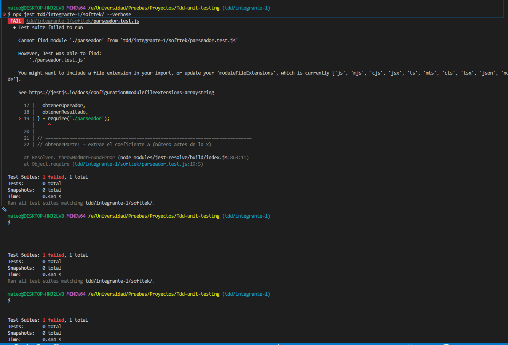
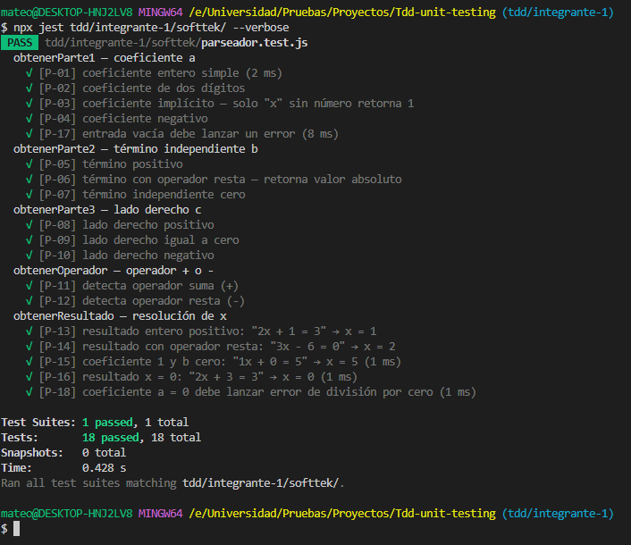

# TDD — Integrante 1: Mateo Berrío Cardona

**Politécnico Colombiano Jaime Isaza Cadavid**  
Ingeniería de Sistemas — ING01201 Pruebas y Gestión de la Configuración  
Rama de trabajo: `tdd/integrante-1`

***

## Ejercicios asignados

| # | Carpeta | Descripción |
|---|---------|-------------|
| 1 | `softtek/` | Parseador de ecuación de primer grado (`ax + b = c`) |
| 2 | `junit5-adaptado/` | Equivalentes de JUnit5 en Jest |

***

## Metodología aplicada

```
🔴 Red    → Escribir el test que falla (implementación no existe aún)
🟢 Green  → Implementar el mínimo código para que el test pase
🔵 Refactor → Mejorar sin romper los tests
```

**Regla fundamental:** ningún archivo de implementación puede existir antes que su archivo de test.

***

## Evidencia de configuración del entorno

### Versión de Jest instalada

```
$ npx jest --version
30.2.0
```

### Resultado de `npm install`

```
added 293 packages, and audited 294 packages in 17s
found 0 vulnerabilities
```

### Configuración `package.json` relevante

```json
{
  "scripts": {
    "test": "jest --verbose",
    "test:watch": "jest --watch",
    "test:coverage": "jest --coverage"
  },
  "devDependencies": {
    "jest": "^30.3.0"
  }
}
```

> **Nota:** El `package.json` no declara `"type": "module"`, por lo que se usa **CommonJS** (`require` / `module.exports`).

***

## Ejercicio 1 — Softtek: Parseador de ecuación de primer grado

### Descripción

Parseador para ecuaciones de la forma `ax + b = c` (ej: `"2x + 1 = 3"`).

### Fórmula de resolución

```
Si operador es "+": x = (c - b) / a
Si operador es "-": x = (c + b) / a
```

### Archivos

| Archivo | Estado | Descripción |
|---------|--------|-------------|
| `softtek/parseador.test.js` | ✅ Creado (🔴 RED) | Suite de tests unitarios |
| `softtek/parseador.js` | ✅ Creado (🟢 GREEN) | Implementación mínima |

***

### Paso 1 — 🔴 RED: Suite de tests (`parseador.test.js`)

**Estado:** Tests escritos. La implementación **no existía aún** → todos los tests fallaban.

#### Matriz de casos de prueba

| ID | Función | Entrada | Resultado esperado | Tipo |
|----|---------|---------|-------------------|------|
| P-01 | `obtenerParte1` | `"2x + 1 = 3"` | `2` | Happy path |
| P-02 | `obtenerParte1` | `"10x - 5 = 15"` | `10` | Coeficiente 2 dígitos |
| P-03 | `obtenerParte1` | `"x + 3 = 7"` | `1` | Coeficiente implícito |
| P-04 | `obtenerParte1` | `"-3x + 2 = 8"` | `-3` | Coeficiente negativo |
| P-05 | `obtenerParte2` | `"2x + 1 = 3"` | `1` | Happy path suma |
| P-06 | `obtenerParte2` | `"2x - 4 = 6"` | `4` | Valor absoluto con resta |
| P-07 | `obtenerParte2` | `"2x + 0 = 3"` | `0` | Término independiente cero |
| P-08 | `obtenerParte3` | `"2x + 1 = 3"` | `3` | Happy path |
| P-09 | `obtenerParte3` | `"5x - 2 = 0"` | `0` | Lado derecho cero |
| P-10 | `obtenerParte3` | `"3x + 1 = -9"` | `-9` | Lado derecho negativo |
| P-11 | `obtenerOperador` | `"2x + 1 = 3"` | `"+"` | Operador suma |
| P-12 | `obtenerOperador` | `"2x - 1 = 3"` | `"-"` | Operador resta |
| P-13 | `obtenerResultado` | `"2x + 1 = 3"` | `1` | x = (3-1)/2 = 1 |
| P-14 | `obtenerResultado` | `"3x - 6 = 0"` | `2` | x = (0+6)/3 = 2 |
| P-15 | `obtenerResultado` | `"1x + 0 = 5"` | `5` | a=1, b=0 |
| P-16 | `obtenerResultado` | `"2x + 3 = 3"` | `0` | x = 0 |
| P-17 | `obtenerParte1` | `""` | lanza `Error` | Borde: entrada vacía |
| P-18 | `obtenerResultado` | `"0x + 1 = 3"` | lanza `'División por cero'` | Borde: a = 0 |

***

### Evidencia — 🔴 RED: Tests fallando (módulo no encontrado)

> Captura tomada **antes** de crear `parseador.js`.  
> Jest confirma que el archivo de implementación no existe aún — comportamiento esperado en TDD.



***

### Paso 2 — 🟢 GREEN: Implementación mínima (`parseador.js`)

**Estado:** Implementación creada con mínimo código para pasar los 18 tests.

#### Estrategia de implementación

Cada función usa una **expresión regular específica** para extraer la parte de la ecuación que le corresponde:

| Función | Regex utilizada | Qué captura |
|---------|----------------|-------------|
| `obtenerParte1` | `/^(-?\d*)x/` | Dígitos antes de `x` (vacío → 1, `-` → -1) |
| `obtenerParte2` | `/x\s*[+\-]\s*(\d+)\s*=/` | Dígitos entre el operador y `=` |
| `obtenerParte3` | `/=\s*(-?\d+)/` | Número después del `=`, incluye negativos |
| `obtenerOperador` | `/x\s*([+\-])\s*\d/` | El símbolo `+` o `-` entre `x` y `b` |

#### Evidencia — 🟢 GREEN: 18/18 tests pasando

> Captura tomada tras crear `parseador.js`.



***
### Paso 3 — 🔵 REFACTOR

> 📋 *Pendiente de revisión tras confirmar GREEN en el entorno local.*

***
## Ejercicio 2 — JUnit5 adaptado a Jest

> 📋 *Esta sección se completará al avanzar.*

### Archivos

| Archivo | Estado | Descripción |
|---------|--------|-------------|
| `junit5-adaptado/calculadora.js` | ⏳ Pendiente | Implementación de soporte |
| `junit5-adaptado/junit5.test.js` | ⏳ Pendiente | Suite de equivalencias JUnit5 |

***

## Historial de commits sugeridos

```bash
# Paso 1 — 🔴 RED
git commit -m "test(integrante-1): agrega suite TDD parseador ecuación 1er grado [RED]"

# Paso 2 — 🟢 GREEN
git commit -m "feat(integrante-1): implementa parseador.js para pasar todos los tests [GREEN]"

# Paso 3 — 🔵 REFACTOR
git commit -m "refactor(integrante-1): limpia lógica del parseador sin romper tests"

# Paso 4+5 — JUnit5
git commit -m "feat(integrante-1): agrega calculadora y suite JUnit5 adaptada a Jest"
```

***

## Comando de ejecución

```bash
# Correr solo los tests de este integrante
npx jest tdd/integrante-1/ --verbose

# Correr con cobertura
npx jest tdd/integrante-1/ --coverage
```