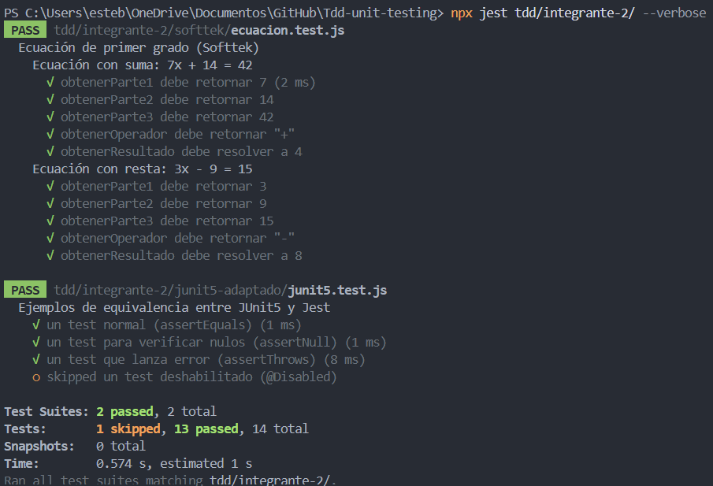
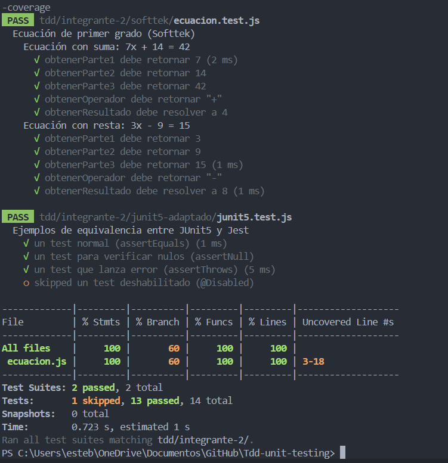

# Integrante 2 — Esteban Cano Ramírez

> **Politécnico Colombiano Jaime Isaza Cadavid**  
> Ingeniería de Sistemas — ING01201 Pruebas y Gestión de la Configuración  
> Docente: David Fernando Mejia Tabares

---

## Descripción

Este directorio contiene los dos ejercicios de pruebas unitarias implementados con la metodología **TDD (Test Driven Development)** correspondientes al integrante 2.

---

## Estructura

```
integrante-2/
├── softtek/
│   ├── ecuacion.test.js   → Tests del parseador de ecuaciones
│   └── ecuacion.js        → Implementación del parseador
└── junit5-adaptado/
    └── junit5.test.js     → Equivalencias de JUnit5 en Jest
```

---

## Ejercicio 1 — Softtek: Ecuación de primer grado

Implementación con TDD de un **parseador de ecuaciones lineales** de la forma `ax + b = c`.

### Funciones implementadas

| Función | Descripción |
|---|---|
| `obtenerParte1(ecuacion)` | Extrae el coeficiente `a` |
| `obtenerParte2(ecuacion)` | Extrae el término independiente `b` |
| `obtenerParte3(ecuacion)` | Extrae el lado derecho `c` |
| `obtenerOperador(ecuacion)` | Detecta el operador (`+` o `-`) |
| `obtenerResultado(ecuacion)` | Resuelve `x = (c - b) / a` o `x = (c + b) / a` |

### Casos de prueba

| Ecuación | a | b | c | Operador | x |
|---|---|---|---|---|---|
| `7x + 14 = 42` | 7 | 14 | 42 | `+` | 4 |
| `3x - 9 = 15` | 3 | 9 | 15 | `-` | 8 |

### Ciclo TDD aplicado

```
🔴 Red    → Se escribieron los tests antes de que existiera ecuacion.js
🟢 Green  → Se implementó el mínimo código para pasar cada test
🔵 Refactor → Se limpió y estructuró el código final
```

### Captura de resultados



---

## Ejercicio 2 — JUnit5 adaptado a Jest

Demostración de las equivalencias entre las anotaciones de **JUnit5 (Java)** y las funciones de **Jest (JavaScript)**.

### Tabla de equivalencias

| JUnit5 | Jest | Descripción |
|---|---|---|
| `@Test` | `test()` | Define una prueba individual |
| `@BeforeAll` | `beforeAll()` | Se ejecuta una vez antes de todos los tests |
| `@BeforeEach` | `beforeEach()` | Se ejecuta antes de cada test |
| `@AfterEach` | `afterEach()` | Se ejecuta después de cada test |
| `@AfterAll` | `afterAll()` | Se ejecuta una vez al finalizar todos |
| `@Disabled` | `test.skip()` | Deshabilita un test |
| `assertEquals` | `expect().toBe()` | Verifica igualdad de valores |
| `assertNull` | `expect().toBeNull()` | Verifica que el valor sea nulo |
| `assertThrows` | `expect().toThrow()` | Verifica que se lance un error |

### Captura de resultados



---

## Cómo ejecutar los tests

```bash
# Desde la raíz del proyecto

# Correr solo los tests del integrante 2
npx jest tdd/integrante-2/ --verbose

# Correr con cobertura de código
npx jest tdd/integrante-2/ --verbose --coverage
```

---

## Referencias

- [Blog Softtek — Testing Unitario](https://blog.softtek.com/es/testing-unitario)
- [JUnit5 User Guide](https://junit.org/junit5/docs/current/user-guide/)
- [Documentación Jest](https://jestjs.io/docs/getting-started)
