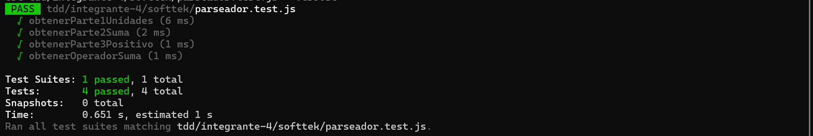
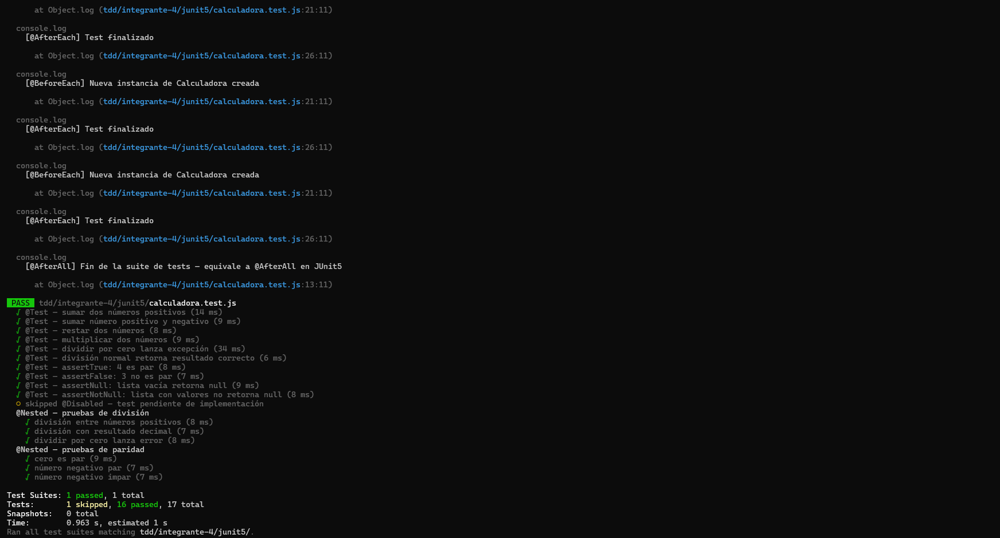
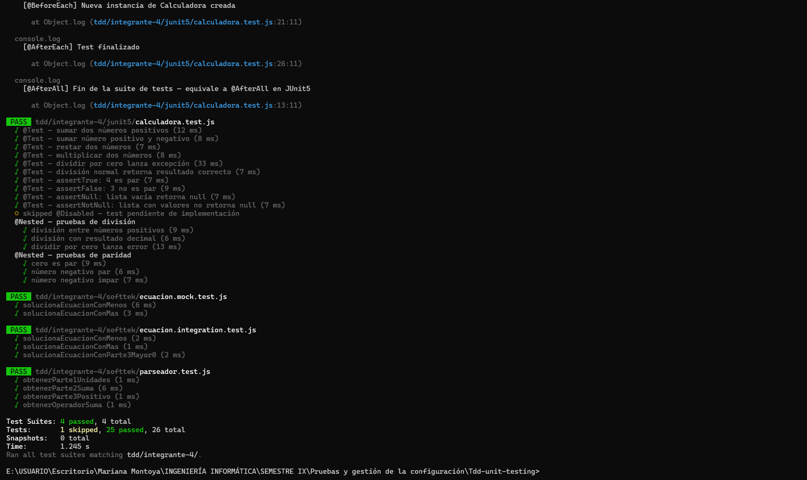

# Integrante 4 — Mariana Montoya Sepúlveda

**Politécnico Colombiano Jaime Isaza Cadavid**
ING01201 Pruebas y Gestión de la Configuración
Docente: David Fernando Mejia Tabares

---

## Descripción

Este módulo contiene los ejercicios individuales de pruebas unitarias desarrollados
con la metodología TDD (Test Driven Development) en JavaScript usando Jest.

Se trabajaron dos fuentes:
1. Blog Softtek — Testing Unitario
2. JUnit5 User Guide — adaptado a Jest


---

## Ejercicio 1 — Softtek: Ecuación de primer grado

**Fuente:** https://blog.softtek.com/es/testing-unitario

### ¿Qué se implementó?

Se resolvió una ecuación de primer grado de la forma `ax + b = c`,
donde la solución es `x = (c - b) / a`.

El ejercicio original está en Java con JUnit 4 y Mockito.
Se adaptó completamente a JavaScript con Jest.

### Clases desarrolladas

**`parseador.js`** — Extrae cada parte de la ecuación desde un string:

| Método | Descripción | Ejemplo |
|---|---|---|
| `obtenerParte1(ecuacion)` | Extrae el coeficiente `a` | `"2x - 1 = 0"` → `2` |
| `obtenerParte2(ecuacion)` | Extrae el término `b` con signo | `"2x - 1 = 0"` → `-1` |
| `obtenerParte3(ecuacion)` | Extrae el lado derecho `c` | `"2x + 1 = 3"` → `3` |
| `obtenerOperador(ecuacion)` | Detecta el operador | `"2x + 1 = 0"` → `"+"` |

**`ecuacion.js`** — Usa el `Parseador` para calcular el resultado:

| Método | Descripción |
|---|---|
| `obtenerResultado(ecuacion)` | Resuelve `x = (c - b) / a` |

### Archivos de test

**`parseador.test.js`** — 4 tests unitarios del Parseador:

| Test | Entrada | Esperado |
|---|---|---|
| `obtenerParte1Unidades` | `"2x - 1 = 0"` | `2` |
| `obtenerParte2Suma` | `"2x + 1 = 0"` | `1` |
| `obtenerParte3Positivo` | `"2x + 1 = 3"` | `3` |
| `obtenerOperadorSuma` | `"2x + 1 = 0"` | `"+"` |

**`ecuacion.integration.test.js`** — 3 tests de integración:

| Test | Entrada | Esperado |
|---|---|---|
| `solucionaEcuacionConMenos` | `"2x - 1 = 0"` | `0.5` |
| `solucionaEcuacionConMas` | `"2x + 1 = 0"` | `-0.5` |
| `solucionaEcuacionConParte3Mayor0` | `"2x + 1 = 10"` | `4.5` |

**`ecuacion.mock.test.js`** — 2 tests con mock del Parseador:

| Test | Mocks configurados | Esperado |
|---|---|---|
| `solucionaEcuacionConMenos` | parte1=2, parte2=-1, parte3=0 | `0.5` |
| `solucionaEcuacionConMas` | parte1=2, parte2=1, parte3=0 | `-0.5` |

### Evidencia



---

## Ejercicio 2 — JUnit5 adaptado a Jest

**Fuente:** https://junit.org/junit5/docs/current/user-guide/#running-tests

### ¿Qué se implementó?

Se tomaron los conceptos y anotaciones principales de JUnit5 y se
implementaron sus equivalentes exactos en JavaScript con Jest,
usando la clase `Calculadora` como SUT.

### Tabla de equivalencias implementadas

| Concepto JUnit5 | Implementación en Jest | Descripción |
|---|---|---|
| `@Test` | `test()` | Define un caso de prueba |
| `@BeforeEach` | `beforeEach()` | Crea nueva instancia antes de cada test |
| `@AfterEach` | `afterEach()` | Limpieza después de cada test |
| `@BeforeAll` | `beforeAll()` | Se ejecuta una sola vez antes de todos |
| `@AfterAll` | `afterAll()` | Se ejecuta una sola vez al final |
| `@Disabled` | `test.skip()` | Deshabilita un test sin eliminarlo |
| `@Nested` | `describe()` | Agrupa tests por contexto |
| `assertEquals` | `expect().toBe()` | Verifica igualdad de valores |
| `assertTrue` | `expect().toBe(true)` | Verifica que la condición sea verdadera |
| `assertFalse` | `expect().toBe(false)` | Verifica que la condición sea falsa |
| `assertNull` | `expect().toBeNull()` | Verifica que el valor sea nulo |
| `assertNotNull` | `expect().not.toBeNull()` | Verifica que el valor no sea nulo |
| `assertThrows` | `expect(() => {}).toThrow()` | Verifica que se lance una excepción |

### Tests implementados

| Test | Concepto JUnit5 demostrado |
|---|---|
| Sumar dos positivos | `@Test` + `assertEquals` |
| Sumar positivo y negativo | `@Test` + `assertEquals` |
| Restar dos números | `@Test` + `assertEquals` |
| Multiplicar dos números | `@Test` + `assertEquals` |
| Dividir por cero lanza excepción | `assertThrows` |
| División normal | `@Test` + `assertEquals` |
| 4 es par | `assertTrue` |
| 3 no es par | `assertFalse` |
| Lista vacía retorna null | `assertNull` |
| Lista con valores no es null | `assertNotNull` |
| Test deshabilitado | `@Disabled` → `test.skip()` |
| División entre positivos | `@Nested` → `describe()` |
| División con decimal | `@Nested` → `describe()` |
| Dividir por cero en nested | `@Nested` + `assertThrows` |
| Cero es par | `@Nested` → `describe()` |
| Negativo par | `@Nested` → `describe()` |
| Negativo impar | `@Nested` → `describe()` |

### Evidencia



---

## Resultados globales
- Test Suites: 4 passed, 4 total
- Tests: 1 skipped, 25 passed, 26 total
- Time: 3.756 s

### Evidencia — Todos los tests



---

## Cómo ejecutar

```bash
# Todos los tests del integrante 4
npx jest tdd/integrante-4/ --verbose

# Solo Softtek
npx jest tdd/integrante-4/softtek/ --verbose

# Solo JUnit5
npx jest tdd/integrante-4/junit5/ --verbose
```

---

## Metodología aplicada

Cada archivo de implementación se creó **después** de su archivo de test,
siguiendo el ciclo TDD:

1. 🔴 **Red** — Se escribió el test, se ejecutó y falló
2. 🟢 **Green** — Se implementó el código mínimo para que pasara
3. 🔵 **Refactor** — Se limpió el código sin romper los tests